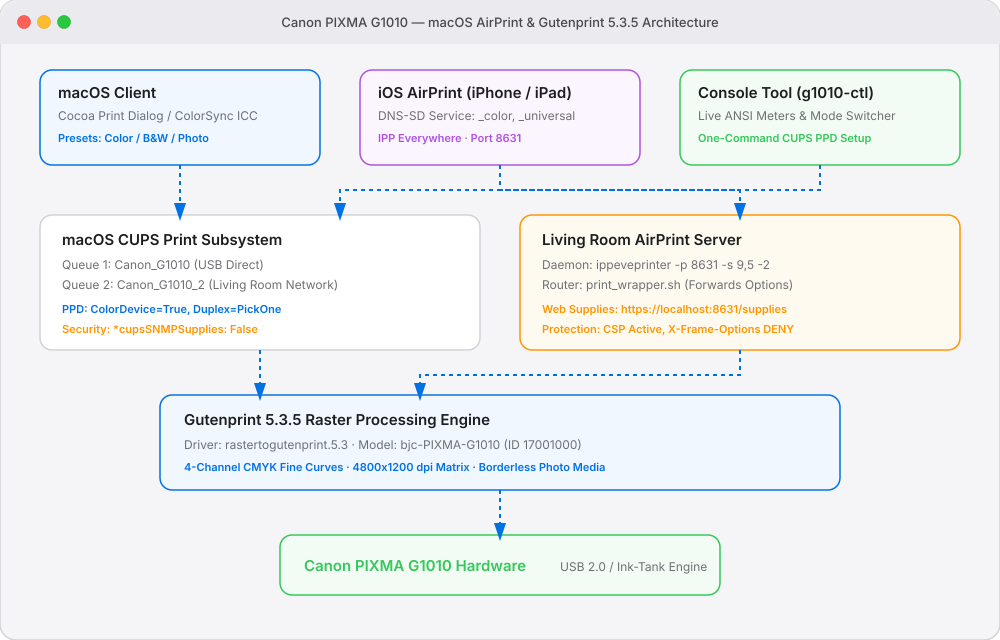

<picture>
  <source media="(prefers-color-scheme: dark)" srcset="./assets/g1010_architecture-dark.svg">
  
</picture>

# ARC_20260909_A — Canon PIXMA G1010 macOS & AirPrint Architecture

> **Parent:** [`architecture-master.md`](./architecture-master.md) · **Status:** Active · **Date:** 2026-09-09
> **Related Plan:** [`G1010`](../plans/01-core/PLN001-canon-g1010-support-and-airprint-integration-plan.md)
> **Owner:** nschabra

---

## 1. Executive Summary

This architecture document defines the end-to-end printing and management pipeline for the **Canon PIXMA G1010** ink-tank printer on modern macOS and network AirPrint environments.

---

## 2. Component Taxonomy

### 2.1 Client Ingress Points
1. **macOS Cocoa Applications** (Safari, Preview, Pages):
   - Communicates with CUPS via PostScript/PDF rasterization.
   - Leverages Apple PPD extensions: `*APPrinterPreset`, `*APSupportsCustomColorMatching`, and ColorSync ICC profiles.
2. **iOS & Network AirPrint Clients** (iPhone, iPad):
   - Discovered over mDNS/DNS-SD (`_ipps._tcp`, `_universal`, `_color`).
   - Streams PDF / JPEG / URF raster jobs directly to port 8631.
3. **Operator CLI Console (`g1010-ctl` / `bin/g1010-ctl`)**:
   - Python 3 interactive console providing visual ANSI ink level meters, one-command PPD deployment, and calibration test prints.

### 2.2 Routing & Middle Tier
1. **CUPS Scheduler (`org.cups.cupsd`)**:
   - Manages local queues: `Canon_G1010` (Direct USB) and `Canon_G1010_2` (Network IPPS).
   - Enforces PPD configuration: `ColorDevice: True`, `DefaultColorSpace: RGB`, `Duplex: PickOne`.
2. **Living Room AirPrint Daemon (`ippeveprinter`)**:
   - Listens on port 8631, advertising 9 ppm black, 5 ppm color (`-s 9,5`), 2-sided support (`-2`), and color DNS-SD (`-r _print,_universal,_color`).
   - Serves authenticated/isolated web status, media, and ink level gauges at `https://localhost:8631/supplies`.
3. **Print Options Router (`print_wrapper.sh`)**:
   - Intercepts incoming IPP jobs and guarantees that client print options (e.g. `ColorModel=RGB`, `MediaType=Plain`) are preserved and forwarded to the CUPS `lp` invocation.

### 2.3 Driver Core & Hardware
1. **Gutenprint 5.3.5 Raster Filter (`rastertogutenprint.5.3`)**:
   - Processes raster streams using the native `bjc-PIXMA-G1010` driver definition (model `17001000`).
   - Renders 4-channel CMYK ink curves optimized for Canon FINE print heads up to 4800x1200 dpi.
2. **Canon PIXMA G1010 Hardware**:
   - High-yield ink-tank hardware connected via USB 2.0.
   - Operates in manual duplex mode with rear-tray feeding.

---

## 3. Cybersecurity & Reliability Invariants

1. **SNMP Probe Suppression**:
   - `*cupsSNMPSupplies: False` is enforced across PPDs to eliminate network hangs and unauthenticated broadcast probing.
2. **Web Interface Isolation**:
   - `ippeveprinter` web forms serve `X-Frame-Options: DENY` and `Content-Security-Policy: frame-ancestors 'none'` to block clickjacking and cross-origin embedding.
3. **Strict Parameter Validation**:
   - `g1010-ctl` sanitizes all terminal arguments before dispatching subprocess commands.

---

## Footer Navigation

Parent: [`architecture-master.md`](./architecture-master.md) · Plans: [`../plans/plans-master.md`](../plans/plans-master.md)
