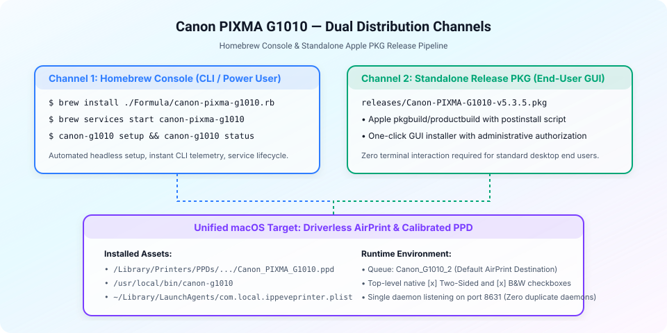

<picture>
  <source media="(prefers-color-scheme: dark)" srcset="./assets/distribution-channels-dark.svg">
  
</picture>

# Concept — Homebrew Console Distribution & Release PKG Pipeline (`CON005`)

> **Parent:** [`concept-design-master.md`](./concept-design-master.md) · **Status:** `Proposed` · **Date:** 2026-09-09
> **Cross-cut:** none · **Fed Plan:** [`PLN005-homebrew-console-distribution-and-standalone-release-pkg-pipeline-plan.md`](../plans/05-distribution/PLN005-homebrew-console-distribution-and-standalone-release-pkg-pipeline-plan.md)

---

## 1. Problem Statement

Distributing printer drivers to macOS users requires addressing two distinct user personas:
1. **Developer & Power-User Persona**: Prefers terminal/console package managers like Homebrew (`brew install ...`, `brew services ...`), automated CLI configuration, and headless deployment scripts without GUI prompts.
2. **Standard macOS End-User Persona**: Expects a single double-clickable `.pkg` installer from a `releases/` directory that handles PPD installation, LaunchAgent registration, and queue creation automatically with zero command-line input.

> **One-line Statement**: Provide a dual-channel distribution architecture featuring an automated Homebrew console formula and a native Apple `pkgbuild`-generated standalone `.pkg` installer cataloged under a `releases/` repository folder.

---

## 2. Distribution Channels Architecture

Dual-channel ingestion routing to a unified local print environment:

| Channel | Persona | Invocation | Package Artifact |
| ---: | --- | --- | --- |
| 1 | CLI / Power-User | `brew install ./Formula/canon-pixma-g1010.rb` | [`Formula/canon-pixma-g1010.rb`](../../Formula/canon-pixma-g1010.rb) |
| 2 | Desktop GUI | Double-click or `installer -pkg ...` | [`releases/Canon-PIXMA-G1010-v5.3.5.pkg`](../../releases/Canon-PIXMA-G1010-v5.3.5.pkg) |

---

## 3. Core Components

### Component A: CLI Companion (`bin/canon-g1010`)
A unified POSIX script with commands:
- `canon-g1010 status`: Inspects USB hardware connection, CUPS queue status, IPP Everywhere daemon state, and printer ink status.
- `canon-g1010 setup`: Creates the `Canon_G1010_2` queue, activates Duplex options, and sets default queue.
- `canon-g1010 test-page`: Dispatches a color and duplex verification print job.
- `canon-g1010 clean`: Dispatches nozzle test and head cleaning commands.

### Component B: Homebrew Console Formula (`Formula/canon-pixma-g1010.rb`)
- Installs the companion utility to `bin/canon-g1010`.
- Installs the calibrated PPD and documentation.
- Defines a Homebrew `service` block wrapping `ippeveprinter` on port `8631`.
- Post-install caveats explaining `canon-g1010 setup`.

### Component C: Release PKG Pipeline & `releases/` Directory
- Script `packaging/macos/build-release-pkg.sh` executing `pkgbuild` and `productbuild`.
- Installs driver files, LaunchAgent plist, and CLI utility.
- Embedded `postinstall` script loads the daemon and provisions `Canon_G1010_2` automatically.
- Outputs artifacts to `releases/Canon-PIXMA-G1010-v5.3.5.pkg`.
- `releases/README.md` publishes SHA256 checksums and verification guidance.

---

## 4. Promotion Path

`CON005` -> Plan [`PLN005`](../plans/05-distribution/PLN005-homebrew-console-distribution-and-standalone-release-pkg-pipeline-plan.md) -> Worklog Execution -> Checkpoint.

## Footer

Parent: [`concept-design-master.md`](./concept-design-master.md) ·
Decisions: [`../decisions/decisions-master.md`](../decisions/decisions-master.md) ·
Plans: [`../plans/plans-master.md`](../plans/plans-master.md)
