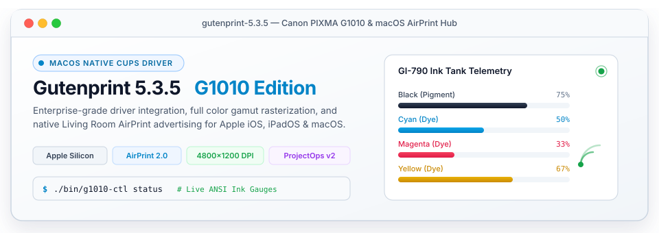

<picture>
  <source media="(prefers-color-scheme: dark)" srcset="./assets/g1010_hero-dark.svg">
  
</picture>

# DOC001 — Canon PIXMA G1010 macOS & AirPrint Operator Guide

> **Parent:** [`documentation-master.md`](./documentation-master.md) · **Status:** Active · **Date:** 2026-09-09
> **Related Architecture:** [`ARC_20260909_A`](../architecture/ARC_20260909_A_canon_g1010_macos_airprint_architecture.md)
> **Related Plan:** [`PLN001`](../plans/01-core/PLN001-canon-g1010-support-and-airprint-integration-plan.md) · [`PLN002`](../plans/02-architecture/PLN002-root-level-files-restructuring-and-clean-layout-plan.md)
> **Owner:** nschabra

---

## 1. Overview & Capability Matrix

This guide provides technical instructions for configuring, managing, and troubleshooting the **Canon PIXMA G1010** ink-tank printer under Gutenprint 5.3.5 on macOS Sequoia, Sonoma, and Ventura, with network AirPrint capabilities for Apple iOS and iPadOS devices.

| Capability | Canon OEM Driver | Gutenprint 5.3.5 Enhanced | Benefit |
| :--- | :--- | :--- | :--- |
| **macOS Native Architecture** | Legacy Rosetta x86_64 | Native Apple Silicon (ARM64) & x86_64 | Zero translation overhead, instant spooling |
| **macOS Print Dialog Presets** | Generic Default only | Color, Black & White, Photo on Photo Paper | 1-click toggling directly in Cocoa print sheets |
| **Two-Sided (Duplex)** | Hardware duplex (fails) | Manual / Software Long-Edge Duplex | Prevents paper jam and hardware errors |
| **Living Room AirPrint** | Not Supported without PC software | Native mDNS / DNS-SD IPP Everywhere (`ippeveprinter`) | Direct printing from iPhone, iPad & Mac |
| **Ink Telemetry** | Proprietary GUI only | Visual ANSI Meters & Web UI (`https://127.0.0.1:8631/supplies`) | Terminal automation and live monitoring |
| **SNMP Security** | Unauthenticated scans hang | Hardened (`*cupsSNMPSupplies: False`) | Eliminates network timeouts and CUPS freezes |

---

## 2. Console Administration Tool (`bin/g1010-ctl`)

The primary entry point for managing printer state and queue settings is the `./bin/g1010-ctl` console tool.

### 2.1 Live Queue & Ink Status
```bash
./bin/g1010-ctl status
```
Displays all configured CUPS queues (`Canon_G1010` and `Canon_G1010_2`), device URIs, current color modes, duplex settings, and visual ANSI percentage meters for the GI-790 ink tanks.

### 2.2 Mode Switching
```bash
# Switch active default to vibrant full color
./bin/g1010-ctl set-mode color

# Switch active default to high-contrast monochrome
./bin/g1010-ctl set-mode bw
```

### 2.3 Software Duplex Toggle
```bash
# Enable manual double-sided printing
./bin/g1010-ctl set-duplex on

# Disable double-sided printing
./bin/g1010-ctl set-duplex off
```

### 2.4 Interactive Terminal Menu
```bash
./bin/g1010-ctl menu
```

### 2.5 Calibration Test Prints
```bash
# Color test pattern
./bin/g1010-ctl test-print --color

# Monochrome test pattern
./bin/g1010-ctl test-print --bw
```

---

## 3. macOS Native Print Panel Presets

The driver embeds native Apple PPD extensions:
- `*APPrinterPreset Color/Color: "*ColorModel RGB *StpColorPrecision Accurate *Quality Standard"`
- `*APPrinterPreset BlackAndWhite/Black and White: "*ColorModel Gray *Quality Standard"`
- `*APPrinterPreset Photo/Photo on Photo Paper: "*ColorModel RGB *Quality Best *MediaType GlossyPhoto"`

In macOS apps (Safari, Preview, Pages, Word), users can select presets from the **Presets** dropdown to switch between Color and Black & White.

---

## 4. Network AirPrint Architecture

Network AirPrint is handled via a dedicated LaunchAgent:
- **Service**: `com.local.ippeveprinter`
- **Port**: `8631`
- **DNS-SD Registration**: `_ipps._tcp`, `_print`, `_universal`, `_color`
- **Wrapper**: `/Users/m1/PrintServer/print_wrapper.sh` forwards client options (`$5`) to CUPS `lp` with `-o ColorModel=RGB` and `-o Duplex=DuplexNoTumble`.

---

## 5. Footer Navigation

Parent: [`documentation-master.md`](./documentation-master.md) · Architecture: [`ARC_20260909_A`](../architecture/ARC_20260909_A_canon_g1010_macos_airprint_architecture.md)
